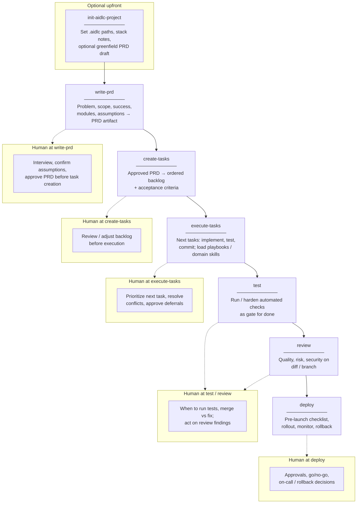

# AIDLC workflow overview

This document summarizes the **AIDLC** pipeline from [AGENTS.md](./AGENTS.md): product definition → backlog → implementation → automated verification → review → deploy. Only **`init-aidlc-project`** is optional (one-time setup). Each step maps to a skill under `skills/<name>/SKILL.md`.

## Pipeline diagram

Canonical order:

```text
[init-aidlc-project] → write-prd → create-tasks → execute-tasks → test → review → deploy
```



Stages run in order (solid arrows). Dashed links highlight where people typically decide, approve, or act on agent output.

## Stages at a glance

| Stage | Skill | What it does | Where humans stay involved |
| ----- | ----- | ------------ | --------------------------- |
| Optional | `init-aidlc-project` | Scaffold `.aidlc/`, paths, stack/architecture notes; optional greenfield PRD draft | Choosing shape, paths, and what goes into domain files |
| 1 | `write-prd` | Capture problem, scope, success, modules, assumptions in a PRD | Interview, assumption checks, **gate: approve PRD** before task creation |
| 2 | `create-tasks` | Turn approved PRD into ordered backlog with acceptance criteria | **Gate: review / adjust backlog** before execution |
| 3 | `execute-tasks` | Implement tasks with tests and commits; use playbooks and domain skills as needed | Ordering work, resolving conflicts, approving deferred acceptance criteria |
| 4 | `test` | Run and harden automated verification | When to run, interpreting failures, merge vs fix |
| 5 | `review` | Structured pass on diff / branch | Acting on findings, merge approval |
| 6 | `deploy` | Pre-launch checklist, rollout, monitoring, rollback | Approvals, go/no-go, on-call, rollback |

## Parallel agents

Parallelism works best **after** scope and backlog are settled. Strong gates (`write-prd`, `create-tasks`) should stay sequential per initiative so one coherent PRD and backlog drive execution.

| Pattern | Use | Keep in mind |
| ------- | --- | ------------- |
| Separate initiatives | Different agents (or sessions) per PRD slug / feature branch | Each initiative still follows the pipeline in order internally |
| Explore / read-only | Parallel agents map code, spike options, or draft sections while one thread owns the PRD | Merge into a single PRD owner before the **write-prd** approval gate |
| Split `execute-tasks` | Independent tasks (different modules, clear contracts) on parallel branches or agents | Avoid overlapping files without coordination; one **test** / **review** path per integration |
| Specialists | Domain skills (for example auth client vs API) on separate tasks | Align interfaces; update backlog if contracts change |
| CI + review | **test** in CI while **review** runs on the same or another PR | Order of skills is unchanged; automation runs in parallel with human or agent review |
| Deploy | Agents prepare checklists and diffs | Humans own production approval and rollback |

### Examples: parallel agents for toil

*Toil* here means repetitive, operational work that burns time but rarely changes product direction. Run it in parallel **around** the pipeline gates, not instead of human approval on scope or backlog.

| Toil type | Example | How parallel agents help |
| --------- | ------- | ------------------------- |
| Discovery & drafts (`write-prd`) | Summarize prior tickets, docs, or Slack threads; compare two design options; list risks and unknowns from the codebase | One agent per source or option; a single owner merges into the PRD before the approval gate |
| Backlog hygiene (`create-tasks`) | Turn narrative PRD sections into draft tasks; add rough sizing labels; find duplicate or overlapping tasks | Parallel passes on different epics or files; human reconciles into one ordered backlog |
| Mechanical implementation (`execute-tasks`) | Rename or move symbols across packages; add boilerplate tests that follow the same pattern; sync API clients after an OpenAPI change; update copy or i18n strings across many files | Shard by directory, package, or locale; merge behind one branch with clear ownership |
| Verification (`test`) | Run disjoint test targets (unit vs integration vs e2e shards); reproduce flakes on repeated runs; collect failure logs into a summary | Matches CI parallelism; agents triage output while engineers fix root causes |
| Review prep (`review`) | Build a change summary for reviewers; check for secrets, TODOs, or license headers; run a focused security or perf pass on a large diff | Different agents for different checklists; still one merge decision after findings |
| Release ops (`deploy`) | Fill pre-launch checklist items (env parity, feature flags, rollback steps); draft comms or runbook updates; gather links to dashboards and alerts | Parallel checklist sections; humans sign off go/no-go |

**Rule of thumb:** Do not skip **write-prd** / **create-tasks** gates to “go faster” with parallel agents. Parallelize exploration, implementation of independent work, cross-PR activity, and toil that does not decide scope—not the approval of scope or task order for the same initiative.

### Todo: enable parallel agents with git worktrees

Use **one worktree per parallel line of work** (branch) so each agent has its own checkout, install, and build—same repo, fewer branch-switch collisions than a single directory.

- [ ] **Pick a primary repo directory** — Keep integration / `main` work here; treat it as where you merge and run full **test** / **review** when integrating.
- [ ] **Create a branch per agent or task** — After `create-tasks`, name branches clearly (for example `feature/area-short-description`); do not put two worktrees on the **same** branch (Git disallows it).
- [ ] **Add worktrees next to the main clone** — From the main repo:

  ```bash
  git worktree add ../<repo>-wt-<topic> -b <branch-name>
  # or: git worktree add ../<repo>-wt-<topic> <existing-branch>
  git worktree list
  ```

- [ ] **Run one agent session per worktree** — Point each agent at only its tree; avoid overlapping files across trees without coordination.
- [ ] **Install dependencies per tree** — Run your package manager install in each worktree (separate `node_modules`, etc.).
- [ ] **Push and open PRs as usual** — Same remote; integrate through your normal merge queue or integration branch.
- [ ] **Remove worktrees when done** — From the main repo: `git worktree remove ../<path>` (or `git worktree prune` if folders were deleted manually).

**When this fits AIDLC:** Most useful during **`execute-tasks`** (parallel implementation) and optional research spikes before **`write-prd`**. Scope and backlog approval stay single-threaded; worktrees isolate *how* parallel work is checked out, not *whether* gates pass.

## See also

- [AGENTS.md](./AGENTS.md) — full agent rules and skill mapping
- [README.md](./README.md) — pipeline table, artifact paths, and how to copy skills into an app repo
