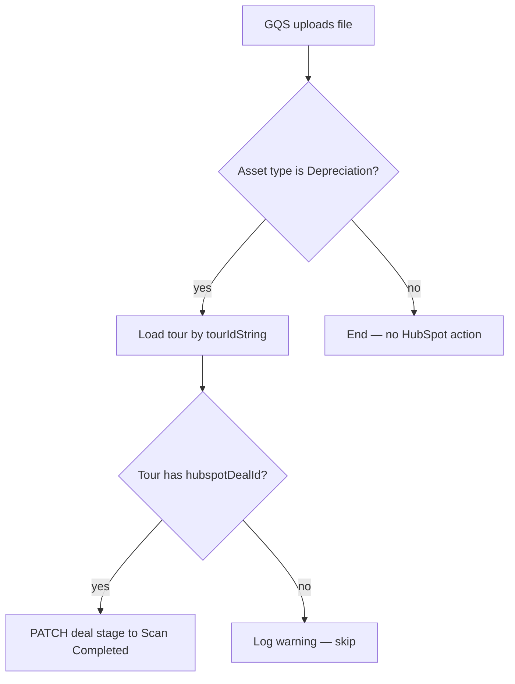

# Style Guide — Confluence Docs

These rules are enforced by the [write-confluence-docs](SKILL.md) skill. Treat them as hard rules unless the user explicitly overrides one.

The rules in sections 1–10 below apply to the **English** file. Section 11 (Vietnamese version rules) adapts them for the parallel `-vi.md` file.

## Voice and tone

- **Plain English first.** Write as if the reader is a smart colleague who does not work on this codebase. A product manager, an operations lead, or a new engineer should all understand the document on first read.
- **Professional, not casual.** No "let's", no "you'll love", no "super easy". Calm, factual, direct.
- **Active voice.** "The platform sends the email" — not "The email is sent by the platform".
- **Present tense for current behaviour, future tense only for planned work.** Mark planned work clearly: "*Planned for LHP-XXXX.*"
- **No marketing words.** Banned list: *powerful, seamless, delightful, leverage, unlock, robust, cutting-edge, world-class, best-in-class, simply, just, easily, effortlessly*.
- **No filler intros.** "This document describes…", "In this section we will explore…" — delete on sight.

## Defining terms

- Define every technical term, internal name, or acronym **the first time it appears**, in the same paragraph or in a glossary entry.
- Use the project's existing vocabulary. Check `docs/lh-knowledge-base/01-platform-overview-stack-glossary.md` and the relevant domain file before inventing a term.
- For ambiguous names (`tour`, `booking`, `partner`), state the LH-specific meaning the first time.

Example:

> When a GQS uploader (GQS is the third-party partner that produces Depreciation Schedule reports) uploads a file via the dropzone, the platform advances the matching HubSpot Deal stage.

## Headings

- Sentence case: "How it works", not "How It Works".
- One H1 per file — the document title.
- H2 for top-level sections; H3 for sub-sections; avoid H4 unless absolutely needed.
- No emoji in headings. No trailing punctuation (no ":" at the end of a heading).
- Headings describe the section contents, not the reader's action ("Booking creation flow" not "Let's look at the booking creation flow").

## Lists

- **Bullets** for unordered facts. ≤ 2 lines per bullet — split if longer.
- **Numbered lists** only when order matters (steps in a sequence).
- Parallel structure: every bullet starts with the same part of speech (all noun phrases, or all verbs).
- No bullets inside bullets unless unavoidable; prefer a sub-heading or a table.

## Tables

Use a table when the content is structured comparison or key/value:

| When to use a table | When NOT to use a table |
|---|---|
| Comparing 2+ options across 3+ attributes | Listing fewer than 3 rows — use bullets |
| Mapping field → type → description | Free-flowing narrative |
| Status matrix (states × allowed transitions) | A single dimension of facts |

- Keep cells short. If a cell needs a paragraph, move that content out of the table.
- The first column is the row identifier; the rest are attributes.

## Check marks and crosses (the only allowed "emoji")

The single exception to the no-emoji rule, and only inside comparison tables, capability matrices, or a checklist:

- Use `✓` (U+2713) for present / supported / done.
- Use `<span style="color:red">✗</span>` for absent / not supported / failing. In a plain markdown context where HTML is not rendered, use `✗` alone.

Example:

| Capability | Web booking | Partner API |
|---|---|---|
| Auto-confirms slot | ✓ | ✓ |
| Sends customer email | ✓ | <span style="color:red">✗</span> |
| Requires payment up front | ✓ | <span style="color:red">✗</span> |

Do not use these characters as decoration in prose.

## Forbidden glyphs

- All Unicode emoji except `✓` and `✗` as defined above.
- Decorative dingbats: `★ ◆ ► ▶ ▪ ●` outside legitimate use.
- Curly quotes inside code blocks (they break copy-paste).

## Diagrams

- Use **Mermaid** for all flows, sequences, state machines, and component diagrams. Confluence renders Mermaid; markdown files diff in git.
- No image attachments. No screenshots inside the doc body — link to the screenshot in Confluence if essential.
- Keep diagrams under 12 nodes / 20 edges. If larger, split into two diagrams or two views.

Preferred Mermaid types:

| Purpose | Mermaid type |
|---|---|
| Step-by-step workflow | `flowchart TD` |
| Cross-system interaction | `sequenceDiagram` |
| Status transitions | `stateDiagram-v2` |
| Data relationships | `erDiagram` |

Example:



## Code references

- Inline file references use the markdown link form: `[bookingService.ts:142](API/API/Bookings/bookingService.ts#L142)`.
- Code blocks: fenced with the correct language tag (`ts`, `tsx`, `sql`, `bash`, `json`).
- Quote only the minimal snippet needed. Never paste entire files.

## Source citations

Every load-bearing claim cites its source:

- Behaviour: `file:line` — e.g. "Idempotency is enforced at [hubspotService.ts:88](API/API/HubSpot/hubspotService.ts#L88)."
- Requirement or constraint: Jira key — e.g. "(LHP-2105)".
- Cross-doc fact: link to the canonical doc — e.g. "See [04-data-models-bookings.md](../../../docs/lh-knowledge-base/04-data-models-bookings.md)".

A claim without a source is a claim from memory. Remove it or verify it.

## Length

- Single-audience doc: 200–600 lines.
- Multi-audience doc: 400–800 lines.
- Above 800 lines, split — Confluence renders large pages slowly and readers stop scrolling.
- Below 150 lines, ask whether a doc is the right format at all (might be release notes or a comment).

## File header

Every doc starts with the standard header block defined in [SKILL.md](SKILL.md#file-header-every-doc-starts-with-this). The header is parseable: status, audience, source, last updated, owner.

---

## Vietnamese version rules

The Vietnamese file (`<slug>-vi.md`) is a parallel professional document, not a literal translation. It mirrors the English file section-by-section and stays in sync with it.

### Voice (Vietnamese)

- **Trang trọng, chuyên nghiệp, dễ hiểu.** Viết như một tài liệu nội bộ chuẩn — không suồng sã, không khẩu ngữ ("nhé", "ạ", "mình", "tớ").
- **Câu chủ động.** "Hệ thống gửi email" — không viết "Email được gửi bởi hệ thống".
- **Thì hiện tại** cho hành vi hiện tại; nêu rõ "*Dự kiến triển khai trong LHP-XXXX.*" cho phần kế hoạch.
- **Không dùng từ marketing.** Cấm: *mạnh mẽ, tuyệt vời, đỉnh cao, vượt trội, dễ dàng, đơn giản chỉ với, chỉ cần, nhanh chóng, thần tốc, tối ưu hoá toàn diện*.
- **Không filler.** Bỏ "Trong tài liệu này, chúng ta sẽ tìm hiểu...", "Phần này mô tả..." — vào thẳng nội dung.

### Terms kept in English

LH product terms, code identifiers, table names, field names, and external system names **always stay in English**, even in the Vietnamese file. On first use, add a brief Vietnamese gloss in parentheses.

| Keep in English | First-use Vietnamese gloss |
|---|---|
| booking | (lượt đặt lịch) |
| partner | (đối tác) |
| tour | (lượt scan / tour) |
| dropzone | (khu vực upload file) |
| deal stage | (giai đoạn deal trong HubSpot) |
| feature flag | (cờ tính năng) |
| webhook | (webhook) |
| organisation | (tổ chức / org) |
| revisit booking | (lượt scan lại) |
| flexi booking | (lượt scan linh hoạt) |
| `bookingService.ts:142` | (giữ nguyên — không dịch path/file) |
| `LHP-2126` | (giữ nguyên — không dịch Jira key) |

This is not exhaustive. Default rule: if a term is a proper noun, a code symbol, a table name, an enum value, or an external product name, keep it in English.

### Section heading translations

Use this table for the standard sections. For ad-hoc sub-headings, translate naturally but keep the sentence-case convention.

| English heading | Vietnamese heading |
|---|---|
| Summary | Tóm tắt |
| Why it exists | Lý do tồn tại |
| Who it affects | Đối tượng ảnh hưởng |
| Current status | Trạng thái hiện tại |
| How it works | Cách hoạt động |
| System overview | Tổng quan hệ thống |
| End-to-end flow | Luồng xử lý đầu-cuối |
| Step-by-step | Các bước chi tiết |
| Data model touched | Mô hình dữ liệu liên quan |
| Key business rules | Quy tắc nghiệp vụ chính |
| Edge cases and limits | Trường hợp đặc biệt và giới hạn |
| Edge cases and failure modes | Trường hợp đặc biệt và các tình huống lỗi |
| Operational notes | Lưu ý vận hành |
| Glossary | Thuật ngữ |
| References | Tài liệu liên quan |
| Executive summary | Tóm tắt cho lãnh đạo |
| What this is | Đây là gì |
| Why it matters | Vì sao quan trọng |
| Table of contents | Mục lục |

### Header block (Vietnamese)

The header keys are translated; the values keep the same format as the EN file.

```markdown
> **Trạng thái:** Bản nháp | Đang review | Đã publish
> **Đối tượng:** PM / Vận hành / Kỹ thuật / Hỗn hợp
> **Nguồn:** {LHP-XXXX} · {path/to/prd-document.md} · {key source files}
> **Cập nhật lần cuối:** {Tháng Năm}
> **Phụ trách:** {Team or người}
```

### Audience labels (Vietnamese)

| English | Vietnamese |
|---|---|
| Customers | Khách hàng |
| Operations / Customer Success | Vận hành / CS |
| Internal engineers | Kỹ sư nội bộ |
| Partners / third parties | Đối tác / bên thứ ba |
| Product manager | Product manager (PM) |
| On-call engineer | Kỹ sư on-call |

### Same-as-English rules

These rules from sections above apply **unchanged** to the Vietnamese file:

- No emoji except `✓` and `<span style="color:red">✗</span>` inside tables/checklists
- One H1 (title); H2 for top-level sections; sentence case; no emoji or trailing punctuation in headings
- Bullets ≤ 2 lines, parallel structure
- Tables for structured comparison only
- Mermaid for all diagrams; no image attachments
- Code blocks with language tags; minimal snippets only
- Every business rule cites a source — same `file:line` or Jira key as the EN version
- Length: 200–800 lines per file
- Standard file header block (with translated keys per above)

### Bilingual sync rule

Both files reference the same source material and must agree on every fact. If a business rule, edge case, or source reference changes in one file, update the other in the same turn. The English file is canonical — when the two disagree, fix the Vietnamese to match the English.
