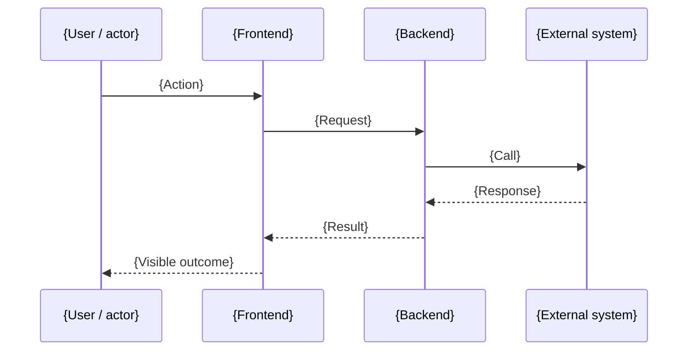

# {Feature or topic title in sentence case}

> **Status:** Draft
> **Audience:** Mixed (PM + Ops + Engineering)
> **Source:** {LHP-XXXX} · {path/to/prd-document.md} · {key source files}
> **Last updated:** {Month Year}
> **Owner:** {Team or person}

## Table of contents

### Part 1 — Executive summary (read this if you have 2 minutes)

1. [What this is](#what-this-is)
2. [Why it matters](#why-it-matters)
3. [Who it affects](#who-it-affects)
4. [Current status](#current-status)

### Part 2 — Deep dive (read this if you build or operate it)

5. [System overview](#system-overview)
6. [End-to-end flow](#end-to-end-flow)
7. [Data model touched](#data-model-touched)
8. [Key business rules](#key-business-rules)
9. [Edge cases and failure modes](#edge-cases-and-failure-modes)
10. [Operational notes](#operational-notes)
11. [Glossary](#glossary)
12. [References](#references)

---

# Part 1 — Executive summary

## What this is

{Three to five sentences. A non-technical reader must understand the feature, the triggering event, and the outcome. No code references, no internal names without a parenthetical explanation.}

## Why it matters

{One short paragraph on the business problem and the value delivered. Quote customer or operations impact if available.}

## Who it affects

| Audience | Impact in one sentence |
|---|---|
| Customers | {…} |
| Operations / Customer Success | {…} |
| Partners | {…} |
| Internal engineers | {…} |

## Current status

| Aspect | Value |
|---|---|
| Shipped | {Date or "planned for {fix version}"} |
| Owner | {Team} |
| Tracking ticket | [LHP-XXXX]({url}) |
| Health | {Stable / Monitored / Known issues — link to issues if any} |

---

# Part 2 — Deep dive

## System overview

{One or two paragraphs naming the components involved — frontend page, API module, external integration, database table. Mention which repo/area each lives in.}

```mermaid
flowchart LR
    User[{Actor}] --> FE[{Frontend page/component}]
    FE --> API[{API module}]
    API --> DB[({Database table})]
    API --> Ext[({External system})]
```

## End-to-end flow



### Step-by-step

1. **{Step name}** — {What happens, where it runs, what state changes}. ([source file:line]({path}))
2. **{Step name}** — {…}. ([source file:line]({path}))
3. **{Step name}** — {…}. ([source file:line]({path}))

## Data model touched

| Table / model | Field | Type | Purpose in this flow |
|---|---|---|---|
| `{table}` | `{field}` | `{type}` | {Why this field matters} |
| `{table}` | `{field}` | `{type}` | {Why this field matters} |

Schema source: [{schema file}]({path}).

## Key business rules

- **{Rule}** — {Plain-English statement}. Source: {file:line or Jira}.
- **{Rule}** — {Plain-English statement}. Source: {file:line or Jira}.
- **{Rule}** — {Plain-English statement}. Source: {file:line or Jira}.

## Edge cases and failure modes

| Scenario | Behaviour | Logged? | Customer impact | Source |
|---|---|---|---|---|
| {Idempotency: same event twice} | {No-op / logged skip} | ✓ | None | {file:line} |
| {Missing dependency: e.g. no HubSpot deal id} | {Skip + warning log} | ✓ | None | {file:line} |
| {External API non-2xx} | {Log error, surface success to user} | ✓ | None visible | {file:line} |
| {Locked state} | {Skip} | ✓ | None | {file:line} |

## Operational notes

- **Monitoring** — {Where to watch. Logs, dashboards, alerts.}
- **Runbook** — {Common operator actions. Link to runbook if separate.}
- **Replay / backfill** — {How to replay a failed event, if possible.}
- **Feature flag** — {Flag name and rollout state, if applicable.}

## Glossary

| Term | Meaning in this document |
|---|---|
| {Term} | {Plain-English LH-specific definition} |
| {Term} | {Plain-English LH-specific definition} |

## References

- Jira: [LHP-XXXX]({jira-url}) — main ticket
- Related Jira: [LHP-YYYY]({jira-url}) — {what it covers}
- PRD: [{prd filename}]({prd path})
- Pull requests:
  - {PR title / URL}
- Source files:
  - [{file}]({path})
  - [{file}]({path})
- Related Confluence pages: {URLs}
- Related knowledge-base docs:
  - [{doc title}]({path})
